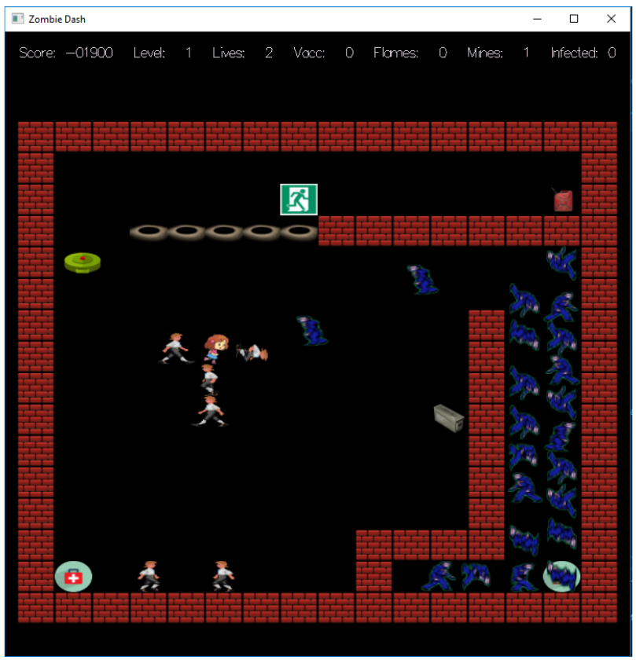

# Zombie Dash

## Introduction

In Zombie Dash, you play the role of Penelope Dolittle, an amateur zombie hunter and professional StarCraft player. Your job is to trek through an abandoned building, rescuing frightened citizens before they are turned into brainless, drooling zombies. On each level, you must lead all of the citizens safely to the level's exit(s), then head through an exit yourself so you can advance to the next level of the building to save more citizens. If you kill some zombies in the process, that's even better. Once you have saved all of the citizens from every level of the building, the game is over.

Here's a screenshot of the game:

In the center left of the screen, you can see Penelope with her shocking red hair, surrounded by four frightened citizens who need to be rescued. You can also see an army of zombies dressed in blue rags. While all of the zombies look the same, some are pretty dumb and just wander around randomly, while others are smart and will attempt to move towards Penelope or citizens if they get too close. Even worse, any time either type of zombie gets next to a person and faces them, the zombie may attempt to vomit on the person. Should the vomit hit the victim, the person will soon become a brainless, vomiting zombie, unless before it's too late, they can get to the exit or use a vaccine. However, only Penelope is clear-headed enough to use a vaccine on herself; a citizen's thinking is too muddled by fear.

On the lower left and right corners of the screen, you see vaccination kits. If Penelope picks one up, she gets a single-use vaccine that she can use to cure herself (by the player's pressing the enter key) should she have been previously infected by zombie vomit. Unfortunately these vaccines aren't protective against future infection; they can only sure a previously-acquired infection should Penelope get vomited on.

In the center right of the screen, you'll notice a metallic box. Penelope can pick up the box in order to obtain two landmines. Once Penelope has picked up the box, she can hit the tab key to deploy a landmine. You can see an active landmine in green in the upper-left corner of the screen. Be careful: Once Penelope deploys a landmine it becomes active almost immediately, and if she or anyone else steps on it, it will explode into flames taking out zombies and people nearby. When a landmine explodes, it will also create a pit in the floor. You can see a row of these pits in the top middle of the screen. A pit is deadly to people and zombies alike; if they step into one, they'll fall though the floor and die.

In the upper right corner, you'll notice a gas can which holds fuel. Fuel you say? When Penelope picks up the gas can, she'll instantly get enough fuel to shoot three searing flames from her not-boring flamethrower 🙂. Just hit the space key to fire. Be careful: although the flames are deadly to zombies, they are also lethal to the citizens you're trying to save, and accidentally taking out a citizen will cost you dearly (you'll lose lots of points!). Flames will also destroy goodies (like vaccines, gas cans, boxes containing landmines, etc.) and cause deployed landmines to explode violently, killing nearby people and zombies alike.

Some dumb zombies hold vaccines (they they presumable somehow acquired in their past). When these zombies die (e.g., from being consumed by a flame, being blown up by a landmine, falling into a pit, etc.), they will sometimes drop a vaccine goodie onto the square where they were standing. Penelope can pick up these vaccines to heal herself from the effects of zombie vomit.

The citizens that Penelope needs to rescue are petrified by fear and generally remain still unless either Penelope or a zombie comes nearby. A citizen will follow Penelope automatically if close enough to her (hoping to be led to an exit), and will attempt to run away from a zombie that gets too close. Because of their panicked state, citizens aren't attentive enough to watch out for pits in the floor or landmines. So be careful: If Penelope leads a citizen near a landmine or a pit, the citizen might trigger the mine or fall through the pit. Both will cost you many points and of course, the loss of a simulated human life 🙁.

In the upper middle of the screen, you see the exit (there may be more than one exit on a level). To complete a level, Penelope must lead all of the living citizens to the exit to save them, then use the exit herself.

Penelope is not superhuman, and she can die if she comes into contact with a flame (hanging in the air are being fired from her flamethrower or a landmine), gets too close to a pit and falls through, or gets infected by a zombie's vomit and turns into a zombie herself. The citizens can also die (or be converted to zombies) in the same ways.

Points are awarded or taken away as follows:
* When Penelope picks up a goodie (a vaccine, gas can, or landmine box): 50 points
* When a citizen makes it safely to the exit: 500 points
* When a dumb zombie is destroyed: 1000 points
* When a smart zombie is destroyed: 2000 points
* When a citizen becomes a zombie or dies for any reason: -1000 points

You control Penelope with the arrow keys, or for lefties and others for whom the arrow key placement is awkward, WASD or the numeric keypad: up is 'w' or '8', left is 'a' or '4', down is 's' or '2', right is 'd' or '6'. Use the space key to fire Penelope's flamethrower (if she's picked up fuel), the tab key to deploy a landmine (if she's picked up landmines), and the enter key to use a vaccine (if she's picked up a vaccine kit). To quit the game at any time, press the 'q' key.
